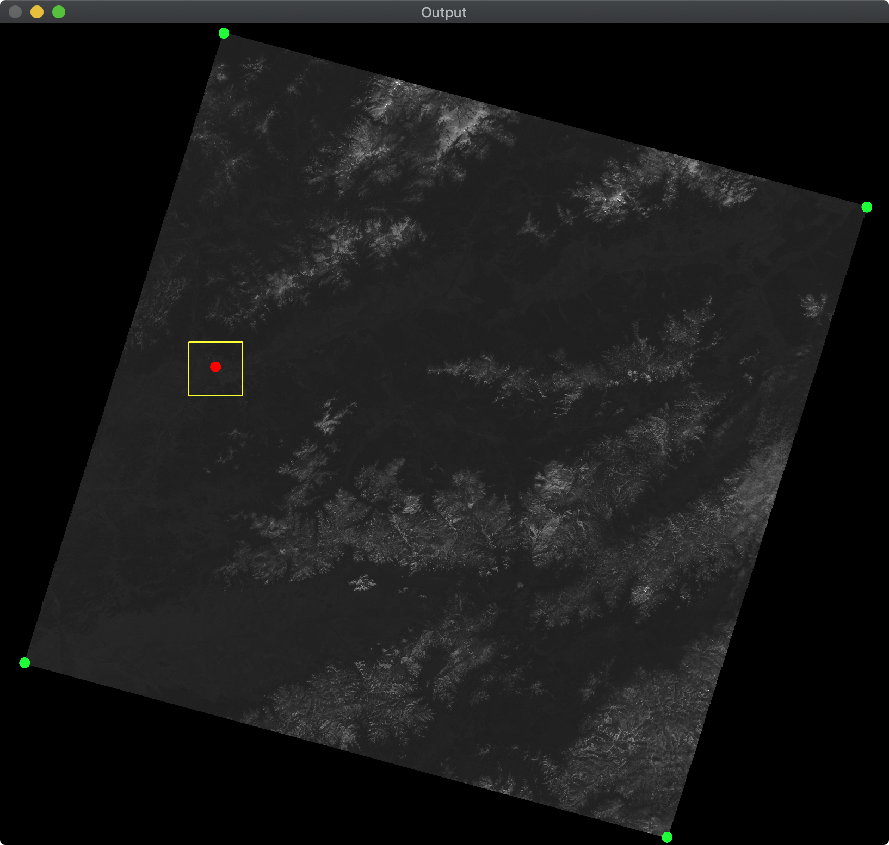

## Лабораторная работа 1
1) Скачиваем снимок L7. Без облаков https://earthexplorer.usgs.gov
2) Находим файл *_MTL.txt
3) Распарсить значения координат углов
4) "Ориентируемся" на снимке
    1) Подсчет дельты по горизонтали и вертикали
    2) https://amazoniainvestiga.info/index.php/amazonia/article/view/992
5) Попробовать вырезать из снимка свой город. Координаты города брать:
    1) Из вики и захардкодить
    2) Из доступных API автоматически

## Скриншоты

Оригинальное изображение с размеченным городом и ROI



Изображение с целевым городом


Консольный вывод


## Компиляция
 ```
 mkdir build
 cd build
 cmake ..
 make
 ```
