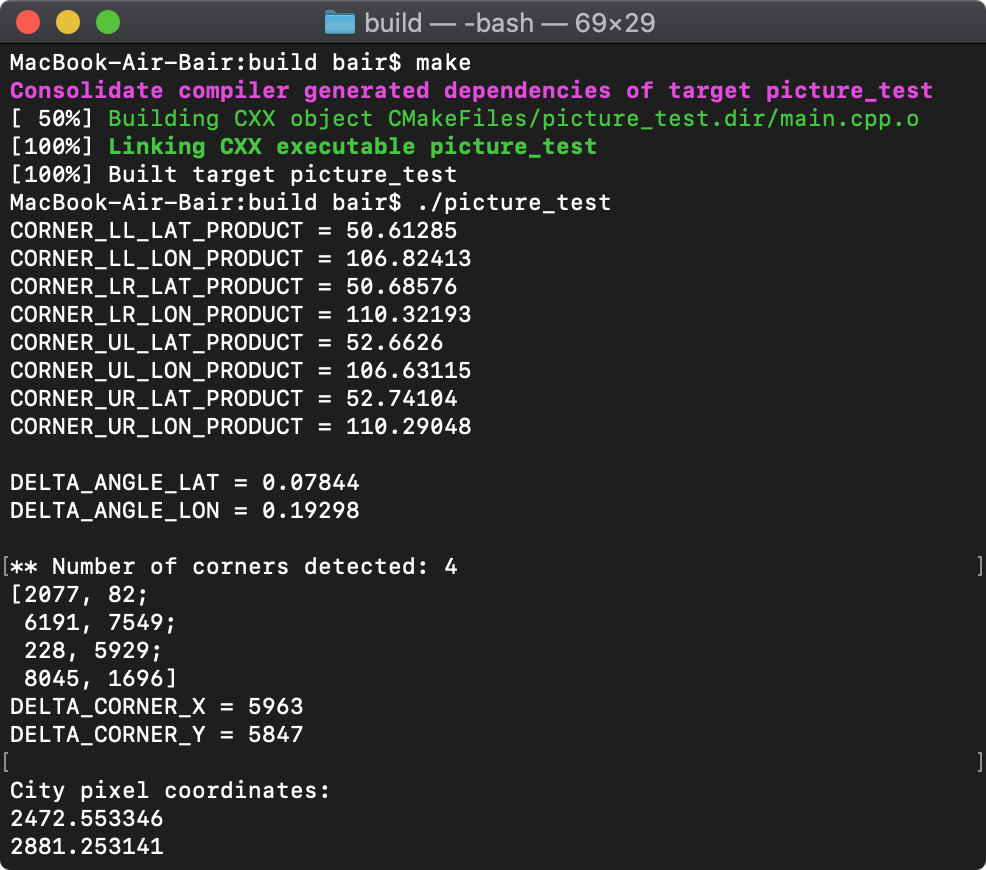
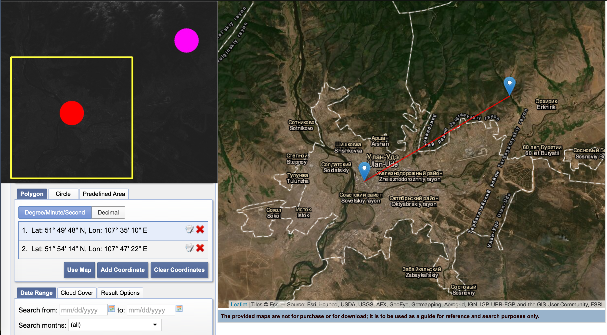

## Оглавление

1. [Постановка задачи](#Постановка-задачи)
2. [Скриншоты](#Скриншоты)
3. [Анализ результатов](#Анализ-результатов)
4. [Компиляция](#Компиляция)

## Постановка задачи
1) Скачиваем снимок L7. Без облаков https://earthexplorer.usgs.gov
2) Находим файл *_MTL.txt
3) Распарсить значения координат углов
4) "Ориентируемся" на снимке
    1) Подсчет дельты по горизонтали и вертикали
    2) https://amazoniainvestiga.info/index.php/amazonia/article/view/992
5) Попробовать вырезать из снимка свой город. Координаты города брать:
    1) Из вики и захардкодить
    2) Из доступных API автоматически

## Скриншоты

Оригинальное изображение с размеченным городом и ROI


Изображение с целевым городом


Консольный вывод



## Анализ результатов
Для сопоставленния широты и долготы города координатам в пикселях на снимке используем следующий алгоритм:
1) Посчитаем дельты снимка:

    DELTA_X = (IMAGE_UPPER_LEFT_X - IMAGE_UPPER_RIGHT_X) / 2 
    
    DELTA_Y = (IMAGE_UPPER_LEFT_Y - IMAGE_LOWER_LEFT_Y) / 2 

2) Найдем координаты города по следущей формуле:

    Х = |UPPER_LEFT_LATITUDE - CITY_LATITUDE| / DELTA_X
    
    Y = |UPPER_LEFT_LONGITUDE - CITY_LONGITUDE| / DELTA_Y

На рисунке отмечены красной точкой реальная позиция города и фиолетовой точкой расчитанная позиция 




Погрешность 19.6 км может быть обусловлена:

1) влиянием угла наклона аэроснимка и рельефом местности (кривизна земли)   
2) математической неточностью выбранного алгоритма

## Компиляция
 ```
 mkdir build
 cd build
 cmake ..
 make
 ```
