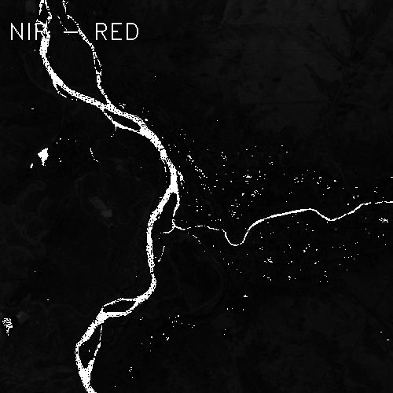
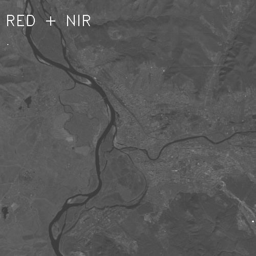
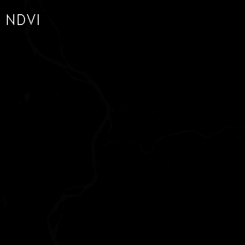
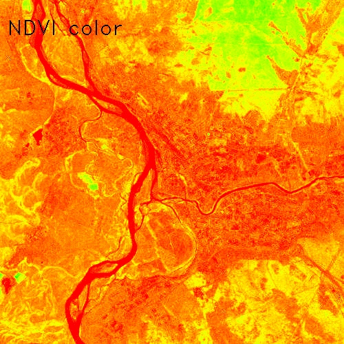

## Лабораторная работа 2
1) Считаем NDVI для вырезанного города;
2) "Разукрасить" город в соответствии со шкалой NVDI.

Информация по спектрам снимка Landsat 7 - https://eos.com/landsat-7/

## Скриншоты
<p float="left">
 

</p>
<p float="left">
 
 
</p>

## Компиляция
 ```
 mkdir build
 cd build
 cmake ..
 make
 ```
