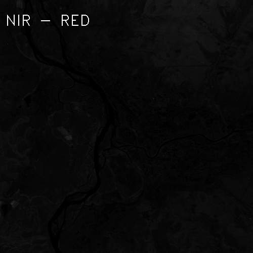

## Лабораторная работа 2
1) Считаем NDVI для вырезанного города;
2) "Разукрасить" город в соответствии со шкалой NVDI.

Информация по спектрам снимка Landsat 7 - https://eos.com/landsat-7/

## NDVI
NDVI is used to quantify vegetation greenness and is useful in understanding vegetation density and assessing changes in plant health. NDVI is calculated as a ratio between the red (R) and near infrared (NIR) values in traditional fashion: 

**(NIR - R) / (NIR + R)**

In Landsat 4-7, NDVI = (Band 4 – Band 3) / (Band 4 + Band 3).

## Скриншоты
<!--
<p float="left">
 

</p>
-->
<p float="left">
 
 
</p>

## Компиляция
 ```
 mkdir build
 cd build
 cmake ..
 make
 ```
